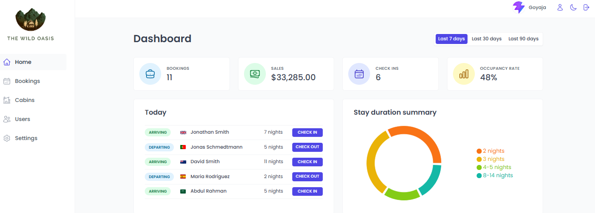
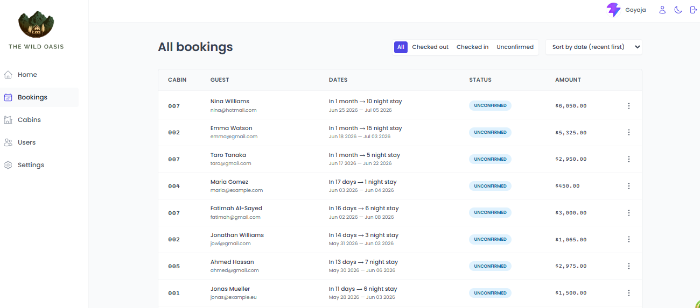
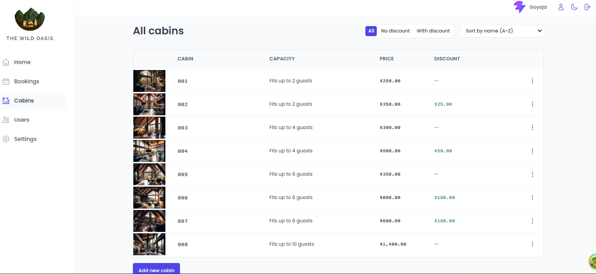

# The Wild Oasis

A modern hotel management web application built for hotel employees to efficiently manage cabins, bookings, guests, and hotel operations from a centralized dashboard.

> This project focuses on providing a clean, scalable, and user-friendly management experience for hotel staff.

## Live Demo

🔗 https://your-deployment-link.com

---

# Features

## Authentication & User Management

- Secure employee authentication system
- Only authenticated hotel employees can access the system
- Create new employee accounts directly inside the application
- Update user profile information
- Upload and manage user avatars
- Change account password securely

---

## Cabin Management

- View all cabins in a responsive table layout
- Display cabin:
  - Photo
  - Name
  - Capacity
  - Price
  - Discount
- Create new cabins
- Update existing cabin information
- Delete cabins
- Upload cabin images

---

## Booking Management

- View all hotel bookings in a structured table
- Booking information includes:
  - Arrival date
  - Departure date
  - Booking status
  - Paid amount
  - Cabin information
  - Guest information
- Filter bookings by status:
  - Unconfirmed
  - Checked In
  - Checked Out
- Manage booking actions:
  - Check In
  - Check Out
  - Delete booking

---

## Guest Management

- Store detailed guest information:
  - Full name
  - Email
  - National ID
  - Nationality
  - Country flag
- Track:
  - Number of guests
  - Number of nights
  - Breakfast selections
  - Guest observations

---

## Payment & Breakfast System

- Confirm guest payments during check-in
- Handle unpaid bookings on guest arrival
- Add breakfast during check-in if not previously selected
- Calculate breakfast pricing automatically

---

## Dashboard & Analytics

The application includes a professional dashboard with hotel insights and operational statistics.

### Dashboard Features

- Guests checking in and checking out today
- Recent booking statistics
- Sales overview
- Occupancy rate tracking
- Daily hotel sales chart
- Extra sales analytics (breakfast sales)
- Stay duration statistics and charts

---

## Application Settings

Manage global hotel settings such as:

- Breakfast price
- Minimum booking nights
- Maximum booking nights
- Maximum guests per booking

---

## UI & UX

- Fully responsive design
- Dark mode support
- Modern dashboard interface
- Clean and intuitive user experience

---

# Tech Stack

## Frontend

- React
- React Router
- Styled Components
- React Query (TanStack Query)
- React Hook Form

## Backend & Services

- Supabase
- Authentication
- Database
- Storage

## Additional Libraries

- React Hot Toastify
- React Error Boundary
- Recharts
- React Icons
- Date-fns

---

# Project Structure

```bash
src/
│
├── context/
├── data/
├── features/
├── hooks/
├── pages/
├── services/
├── styles/
├── ui/
├── utils/
```

---

# Installation

## Clone the repository

```bash
git clone https://github.com/istiakAHMEDsaad/The_Wild_Oasis
```

## Navigate to the project directory

```bash
cd the-wild-oasis
```

## Install dependencies

```bash
pnpm install
```

## Start the development server

```bash
pnpm dev
```

---

# Environment Variables

Create a `.env` file in the root directory and add the following variables:

```env
VITE_SUPABASE_URL=''
VITE_SUPABASE_KEY=''
VITE_STORAGE_CABIN=''
VITE_AVATAR=''
```

---

# Future Improvements

- Real-time booking updates
- Email notifications
- Multi-role authorization system
- Advanced analytics
- Mobile optimization
- Reservation calendar view

---

# Screenshots





---

# Author

**Saad**

Full Stack Developer & AI Enthusiast

GitHub: [istiakAHMEDsaad](https://github.com/istiakAHMEDsaad) </br>
Portfolio: [My portfolio](https://my-portfolio-simpleproject.vercel.app/)

---

# License

This project is licensed under the MIT License.

All reusable component heavily used with compound components

Ref:

1. supabase js docs: https://supabase.com/docs/reference/javascript/introduction
2. reactClone docs: https://react.dev/reference/react/cloneElement
3. createPortal: https://react.dev/reference/react-dom/createPortal
4. getBoundingClientRect: https://developer.mozilla.org/en-US/docs/Web/API/Element/getBoundingClientRect
5. Prop-Types example: https://www.geeksforgeeks.org/reactjs/reactjs-proptypes/
